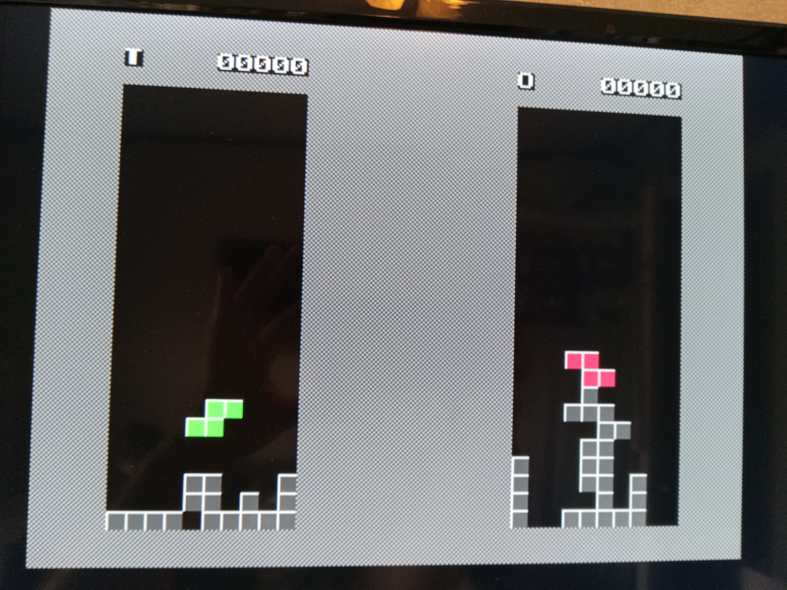

<b>Acolyte Hand PIC'd 24</b>

This is a single-chip retro-style computer using only the PIC24EP512GP204 microcontroller.  Inspired by Voja Antonic's design found here:  http://www.voja.rs/PROJECTS/GAME_HTM/1_intro.htm

It is designed to output VGA display at 320x240 with 16 colors, and 2-voice audio square waves.

It is designed to receive input from a Sega Genesis controller, PS/2 Keyboard or Mouse, and 8 on-board buttons.

It is designed to use a MicroSD Card Adapter, and an FT232RL USB Adapter.

Programmed using MPLAB IDE X via a PICkit3.

See my Youtube video for the Bad Apple demo <a href="https://www.youtube.com/watch?v=rc4UsAqcSHg">here</a>.

*** LED silkscreen is confusing!!! ***

*** ICSP pins physically block the SDcard and FT232RL adapters!!! ***

*** Connected an MCP2221 to the USB connector for serial data transfer!!! ***

*** Tested with LCD, speaker, and with additional PIC24 chip for USB capability!!! ***

A full 16-colors are available!

Tetra always seems to be the first game for any system.

It can even run Bad Apple!

